# Laravel ERP

## Expression des Besoins pour le développement de WorkerCPF 

L'entreprise gère actuellement ses activités à l'aide d'un ensemble de feuilles de calcul Excel et souhaite abandonner ce système et développer une application web pour le remplacer. 

L’entreprise  souhaite  que  l'application  ne  soit  accessible  qu'aux  utilisateurs enregistrés. 

Les utilisateurs auront accès aux différentes vues et fonctionnalités de l'application en fonction de leurs rôles. 

Lorsque  les  actions  effectuées  par  l'application  doivent  être  communiquées, l'application génère automatiquement des courriers aux utilisateurs concernés. 

Le service Ressources Humaines souhaiterait disposer d'un module pour la gestion des demandes de congés. Ce module doit notifier le responsable RH par e-mail à chaque fois qu'une nouvelle demande de congé est générée. 

## Résumé du projet 

Développement de divers modules pour l'application ERP (Enterprise Resource Planning) de l'entreprise : 

- Gestion des utilisateurs de l'application. Permet la création et la gestion des utilisateurs et des rôles ainsi que la création et la gestion des permissions attribuées aux rôles. 
- Gestion des clients de l'entreprise. Permet la création et la gestion des fichiers clients de l'entreprise ainsi que leur importation depuis le système de gestion des clients actuel. 
- Gestion des projets de l'entreprise. Ce module offre une vue d'ensemble des projets de l'entreprise avec des alertes visuelles pour indiquer si un projet a atteint sa charge maximale prévue ou s'il l'a dépassée. Lorsqu'un projet est créé, modifié ou  supprimé,  l'application  envoie  automatiquement  des  e-mails  à  tous  les utilisateurs liés au projet. 
- Gestion  des  contrats  de  support  de  l'entreprise,  ce  module  offre  les  mêmes fonctionnalités que le module de gestion des projets. 
- Compte rendu d’activité (CRA). Ce module est un outil de rapport consistant à justifier l’ensemble du travail accompli sur une période par un consultant, porté pour le compte d’un client, éventuellement lié à un projet ou à un contact de soutien appartenant au client. 
- Gestion des demandes de déblocage d'activités. Les activités sont automatiquement bloquées lorsque le responsable de la comptabilité les signale comme facturées. Dans  ce  cas,  les  utilisateurs  disposent  d'un  formulaire  pour  demander  leur déblocage  qui  génère  et  envoie  automatiquement  un  e-mail  avec  les  données  de l'activité, du projet, des consultants et les raisons de la demande. Le comptable dispose  d'une  vue d'ensemble  des  demandes  avec  la  possibilité  de  filtrer  par client, par consultant, et par statut de traitement ainsi que des formulaires nécessaires pour les traiter et y répondre. 
- Gestion des absences. Ce module est utilisé par les utilisateurs en fonction de leurs rôles, un utilisateur avec le rôle "consultant" l'utilisera pour la création d'une demande de congé, qui sera automatiquement envoyée par email aux utilisateurs avec le rôle "RH", qui auront à leur disposition un aperçu de toutes les demandes générées, avec la possibilité de filtrer par dates, utilisateurs, et statut de traitement;  ainsi  qu'avec  les  formulaires  pour  leur  traitement  et  l'envoi automatique d'email avec la réponse. 

## Technologies Utilisées 

- VS Code 
- Git Lab 
- Docker desktop 
- DBeaver 
- MailHog 
- Postman 
- WSL2 - Ubuntu 
- HTML, CSS, JS, PHP 
- MariaDB 
- Laravel 
- Livewire 
- Alpine.js 
- Tailwind CSS 

## Page de Accueil 

Login : 

En arrivant sur le site, les utilisateurs trouvent une page pour se connecter en entrant un email et un mot de passe, ce dernier champ possède un bouton qui permet de cacher ou d'afficher les caractères (1). Cette vue comporte également un lien d'accès au formulaire de réinitialisation du mot de passe (2). 

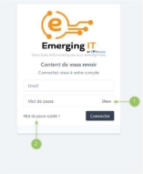

Réinitialisation du mot de passe : 

Ce formulaire permet à un utilisateur enregistré de saisir son adresse électronique. 

En cliquant sur le bouton de réinitialisation du mot de passe, l'application (si l'utilisateur existe) enverra automatiquement un lien à l'adresse électronique saisie contenant un lien et des instructions pour réinitialiser le mot de passe. 

 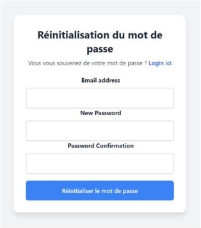

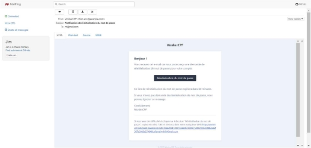

## Tableau de Bord 

Une fois identifié, l'utilisateur sera dirigé vers la page principale de l'application, qui comporte une barre de navigation, à l’intérieur de laquelle se trouvent les liens vers les différentes pages de gestion des tableaux ainsi que le retour à la page d’accueil. 

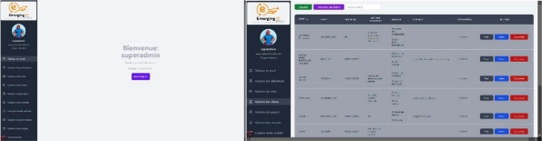

Cette page comporte également un bouton qui permet à l'utilisateur d'accéder à la gestion de son profil, où il peut modifier son mot de passe ainsi que sélectionner son image de profil, avec un bouton permettant d'ouvrir l'explorateur de fichiers, de sélectionner une image sur son ordinateur et de la prévisualiser dans l'espace prévu à cet effet dans le formulaire. 

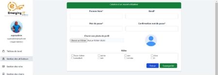

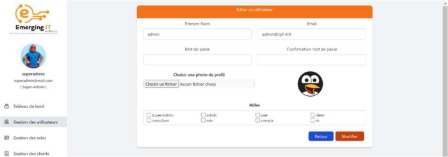

## Gestion des Rôles 

Cette  vue  fournit  une  liste  des  rôles  existants,  les  permissions  qui  leur  sont attribués et les boutons permettant la création, la vue, l'édition, ou la suppression de chacun d'entre eux.  

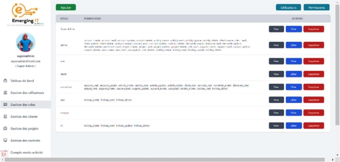

## Gestion des Clients 

Cette vue fournit une liste des clients existants dans la base de données, leurs données principales et les boutons d'action habituels. Elle comporte également un bouton permettant  d'importer  des  clients  à  partir  de  l'application  de  facturation  utilisée  par l'entreprise,  ainsi  qu'un  champ  de  recherche  permettant  de  réduire  le  nombre  de  clients répertoriés. Les résultats peuvent être triés par ordre croissant ou décroissant en cliquant sur les en-têtes des colonnes respectives. 

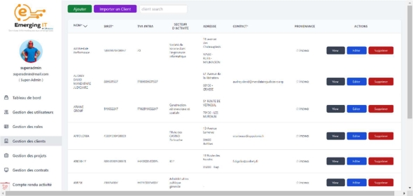

## Gestion des Projets / Contrats 

Cette vue fournit une liste des projets existants dans la base de données, leurs données principales et les boutons d'action (créer, visualiser, modifier et supprimer).  

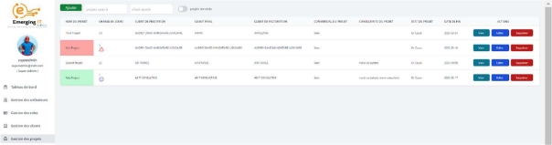

Elle comporte également de deux champs de recherche permettant de réduire le nombre de projets répertoriés et des alertes visuelles pour indiquer si un projet a atteint ou dépassé  sa  charge  maximale.  Les  résultats  peuvent  être  triés  par  ordre  croissant  ou décroissant en cliquant sur les en-têtes des colonnes respectives. 

Les formulaires de création et d'édition comportent des champs de recherche (clients, vendeurs et consultants) qui, lorsqu'on clique dessus, affichent une liste déroulante des dix premiers éléments de la base de données et la possibilité de réduire la liste au fur et à mesure de la saisie des caractères. 

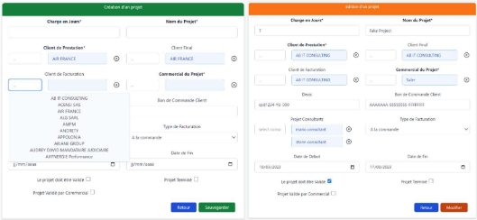

Le bouton de visualisation permet d'obtenir une vue détaillée des informations sur le projet sélectionnée et des activités liées au projet. Cette vue comporte également des alertes visuelles liées à la charge du projet. 

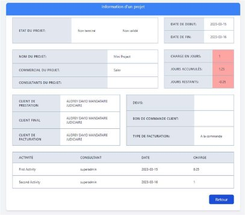

## Module Compte Rendu de Activités 

Cette  vue  affiche  la  liste  des  activités  réalisées  dans  le  cadre  des  projets  ou contrats de l'entreprise au cours d'un mois donné. Elle comporte deux champs de recherche et des boutons d'action. Ses données peuvent être triées par ordre croissant ou décroissant en cliquant  sur  les  en-têtes  de  colonne.  Au  bas  du  tableau,  vous  pouvez  voir  les  liens  de navigation et les informations (par page et totales) sur la charge enregistrée.  

Cette  vue  offre  différentes  configurations  en  fonction  du  rôle  de  l'utilisateur connecté. Par exemple : s'il s'agit d'un utilisateur ayant le rôle d'"administrateur", la liste affichera les activités totales de tous les utilisateurs ; s'il s'agit d'un utilisateur ayant le rôle de  "consultant", la liste  n'affichera que les activités appartenant à cet utilisateur. 

Dans la partie supérieure, deux onglets permettent de basculer entre la liste des activités réalisées dans le cadre d'un projet ou dans le cadre d'un contrat. 

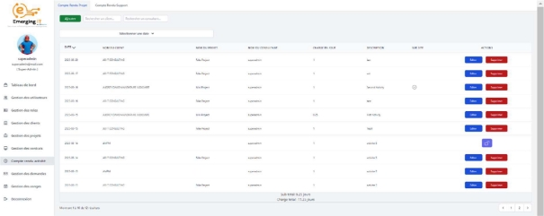

Si une activité a déjà été facturée par l'entreprise, elle sera bloquée et une icône de cadenas s'affichera à la place des boutons d'action, permettant d'accéder à un formulaire de demande de déblocage de l'activité.  

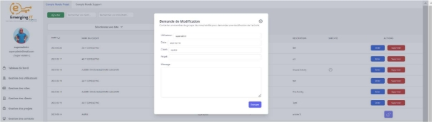

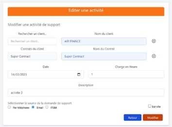

Les formulaires de création et d'édition d'activités comportent un champ de recherche pour sélectionner le client et un second champ où sont affichés les contrats relatifs au client sélectionné. 

## Gestion de Conges 

Cette vue affiche une liste des demandes de congé formulées par les utilisateurs, avec des boutons d'action (créer, consulter, modifier, supprimer), des champs de recherche, des liens  de  navigation,  des  filtres  (en  attente,  accepté,  rejeté,  tous)  et  un  sélecteur permettant de basculer entre la vue en liste et la vue en calendrier. 

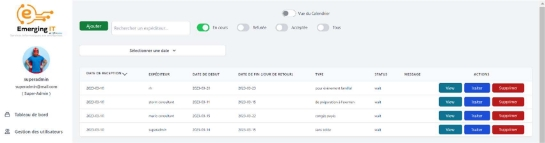

Cette  vue  affiche  différentes  informations  en  fonction  du  rôle  de  l'utilisateur connecté. Par exemple, s'il s'agit d'un utilisateur ayant le rôle "rh" ou "administrateur", la  liste  affichera  toutes  les  demandes,  sinon  la  liste  n'affichera  que  les  demandes appartenant à l'utilisateur connecté et le calendrier affichera les demandes (en attente ou approuvées) appartenant à cet utilisateur et celles appartenant au reste des utilisateurs ayant le même rôle. 

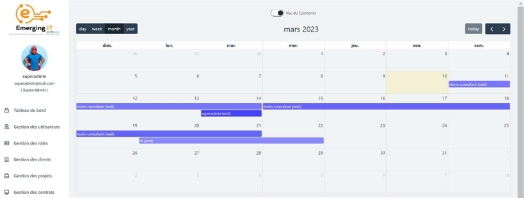

## Envoi de courriers 

L’application génère et envoie automatiquement des courriers électroniques à tous les utilisateurs concernés lorsque l'une des actions suivantes est effectuée : 

- Création d'un utilisateur 
- Demande de réinitialisation du mot de passe 
- La création d'un projet ou d'un contrat 
- Modification d'un projet ou d'un contrat 
- La suppression d'un projet ou d'un contrat 
- Demande de déblocage d’une activité 
- Traitement de demande de déblocage d’une activité 
- Demande de congés 
- Traitement d'une demande de congés 

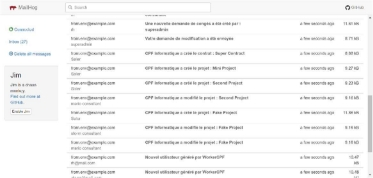 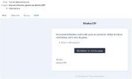

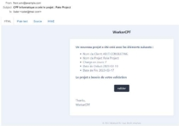 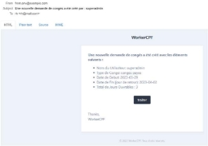

Documentation 

L'application dispose également d'une vue contenant la documentation technique et les extraits de code nécessaires pour expliquer son fonctionnement au professionnel chargé de l'administrer. 

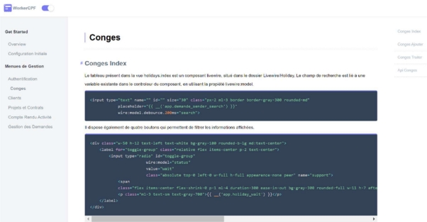
